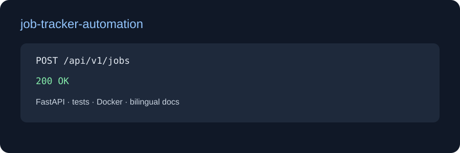

# Job Tracker & Automation

[English](README.md) | [Türkçe](README_TR.md) | [Deutsch](README_DE.md)

İlan kaydeden, beceri eşleşmesini açıklayan ve ilanı saved, applied, interview veya rejected durumları arasında ilerleten üretime yakın takip API'si.

## Teknolojiler
Python, FastAPI, Pydantic, Playwright entegrasyon sınırı, SQLite/PostgreSQL'e hazır kalıcılık sınırı, Docker, pytest ve GitHub Actions. MVP deterministik testler için bellekte çalışır; sonraki adaptör ilanları veritabanına kaydeder ve retry'lı Playwright collector/scheduler ekler.

## API ve çalıştırma
- POST /api/v1/jobs ilanı kaydeder ve eşleşen becerileri döndürür.
- PATCH /api/v1/jobs/{id}/status?status=applied durum günceller.
- GET /api/v1/jobs dashboard akışını listeler.

Maaş taraması açıktır: salary_text para birimine ve sayısal aralığa ayrıştırılır. volunteer, unpaid, equity-only, token-only veya project-token ifadeleri is_paid=false döndürür; böylece başvuru öncesi elenebilir.

Örnek gövde:

    {"title":"Backend Engineer","company":"Acme","url":"https://example.com/1","description":"Python FastAPI","salary_text":"$60,000-$70,000 USD"}

    pip install -e ".[dev]"
    uvicorn app.main:app --reload
    pytest -q

Docker: docker compose up --build. API dokümanı: /docs.

Gelecek collector yalnızca gerçek maaş bilgisini kabul etmeli; token, gönüllü ve ücretsiz ilanları elemelidir.
